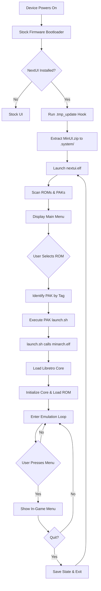

# NextUI – Folder Structure & Architecture

## Repository Structure Overview

```
NextUI/
├── skeleton/          # File tree templates for SD card deployment
│   ├── BASE/         # Minimal install (BIOS, ROMs, Saves folders + updater)
│   ├── BOOT/         # Platform-specific boot hooks (.tmp_update)
│   ├── EXTRAS/       # Additional emulators, tools, overlays, shaders
│   └── SYSTEM/       # Hidden .system folder (binaries, libs, cores, res)
├── workspace/        # Source code for all binaries
│   ├── all/          # Cross-platform shared code
│   ├── tg5040/       # TrimUI Brick & Smart Pro specific code
│   ├── desktop/      # macOS/Linux desktop build (dev/debug)
│   └── _unmaintained/ # Legacy code for retired platforms
├── toolchains/       # Docker-based cross-compilation toolchains (pulled at build)
├── releases/         # Build artifacts (zip files)
├── github/           # GitHub-specific assets (screenshots, workflows)
├── makefile          # Top-level build orchestration
├── makefile.toolchain # Docker container wrapper
├── makefile.native   # macOS/Linux native builds
├── README.md         # User-facing documentation
├── PAKS.md           # PAK authoring guide
└── todo.txt          # Maintainer notes and task list
```

---

## Top-Level Directory Responsibilities

### `skeleton/`
**Purpose**: File tree templates copied to the SD card during installation.

#### `BASE/`
- **Minimal install**: ROM folders (`Roms/`, `Bios/`, `Saves/`, `Cheats/`, `Shaders/`)
- **Updater payload**: `MinUI.zip` containing `.system/` and `.tmp_update/` bootstrap
- **README**: User documentation

#### `BOOT/`
- **Platform-specific bootstrap**: `.tmp_update/` hooks for Miyoo/TrimUI devices
- **Installer scripts**: Executed on first boot to unpack `.system/`

#### `EXTRAS/`
- **Additional emulators**: Paks for systems not included in BASE (A2600, Lynx, NeoGeo Pocket, etc.)
- **Tools**: Settings, Battery Monitor, Clock, Input Tester, LED Control, etc.
- **Assets**: BIOS files, shaders, overlays, ROMs for extras

#### `SYSTEM/` (becomes `.system/` on SD card)
- **Platform folders**: `tg5040/`, `desktop/`, etc. containing binaries, libraries, cores
- **Shared resources**: `res/` folder with fonts, icons, UI assets
- **version.txt**: Release version and git commit hash

---

### `workspace/`
**Purpose**: All source code, makefiles, and build logic.

#### `all/` – Cross-Platform Shared Code
Core modules used by all platforms:

| Module              | Description |
|---------------------|-------------|
| `nextui/`           | Main UI application (menu, file browser, settings) |
| `minarch/`          | Libretro core runner (emulation engine) |
| `minput/`           | Input remapping tool |
| `battery/`          | Battery monitoring tool |
| `batmon/`           | Battery history daemon |
| `libbatmondb/`      | Battery database library |
| `gametime/`         | Game time tracking tool |
| `gametimectl/`      | Game time database management |
| `libgametimedb/`    | Game time database library |
| `clock/`            | Clock/time configuration tool |
| `settings/`         | Global settings manager |
| `syncsettings/`     | Brightness/volume synchronization daemon |
| `ledcontrol/`       | LED customization tool (Brick only) |
| `bootlogo/`         | Boot logo selector |
| `nextval/`          | Value picker utility |
| `common/`           | Shared headers, utilities, scalers |
| `cores/`            | Libretro core submodules (when built) |
| `readmes/`          | README formatting utilities |

#### `tg5040/` – TrimUI Brick & Smart Pro Specific Code

| Module              | Description |
|---------------------|-------------|
| `platform/`         | Platform abstraction (video, input, power, CPU) |
| `libmsettings/`     | MinUI settings library (volume, brightness, WiFi, BT) |
| `keymon/`           | Input event monitor daemon |
| `wifimanager/`      | WiFi daemon and UI |
| `btmanager/`        | Bluetooth daemon and UI |
| `audiomon/`         | Audio device hotplug monitor |
| `rfkill/`           | Radio kill switch utility |
| `show/`             | Image display utility (boot/shutdown screens) |
| `install/`          | Installation scripts |
| `cores/`            | Core compilation makefile |

#### `desktop/` – Development Build for macOS/Linux
- Allows running NextUI/minarch on desktop for rapid iteration
- Uses SDL2 windowed rendering instead of framebuffer
- Simplified platform abstraction

#### `_unmaintained/` – Legacy Platform Code
**Status**: Deprecated, kept for reference.

Contains full platform implementations for retired devices:
- `miyoomini/` (Miyoo Mini, Miyoo Mini Plus)
- `rg35xx/` (Anbernic RG35XX)
- `rg35xxplus/` (RG35XX+, RG40XX, RG Cube)
- `rgb30/` (Powkiddy RGB30)
- `trimuismart/` (TrimUI Smart)
- `my282/`, `my355/`, `m17/`, `gkdpixel/`, `magicmini/`, `zero28/`

**Issue**: Significant code duplication (~60% of C source is in `_unmaintained/`).

---

### `toolchains/` (Git-Cloned at Build Time)
**Purpose**: Docker containers with cross-compilation toolchains.

- Pulled from `github.com/LoveRetro/<platform>-toolchain` repos
- Each platform has a dedicated Dockerfile, sysroot, and build environment
- Ensures reproducible builds across contributors

---

## Main Architectural Modules

### 1. **UI Layer (`nextui/`)**

**File**: `workspace/all/nextui/nextui.c` (3221 lines)

**Responsibilities**:
- File browsing (ROMs, collections, recents)
- Menu rendering and navigation
- Settings management
- Game switcher
- Recent game tracking
- PAK detection and launching

**Key Data Structures**:
```c
typedef struct Entry {
    char* path;
    char* name;
    int type; // ENTRY_DIR, ENTRY_ROM, ENTRY_PAK, ENTRY_DIP
} Entry;

typedef struct Directory {
    Array* entries;      // List of Entry*
    Array* alphas;       // Alphabetical index (A-Z)
    int selected;        // Current selection
    int top;             // Scroll offset
} Directory;

typedef struct Recent {
    char* path;          // ROM path
    char* name;          // Display name
    char* alias;         // Alternate name
} Recent;
```

**Control Flow**:
1. Parse command-line args (resume, launch ROM, etc.)
2. Load recent games from `recent.txt`
3. Scan ROM directories and PAKs
4. Enter main event loop:
   - Poll input (`PAD_poll`)
   - Update directory browser state
   - Render UI (`GFX_flip`)
   - Handle selection → launch PAK or minarch

**Observations**:
- `main()` is **1120 lines** – should be split into initialization, event loop, and cleanup phases
- Heavy use of global state (e.g., `recents`, `stack`, `root`)
- Custom data structures reimplemented (Array, Hash) instead of using standard libraries

---

### 2. **Emulation Engine (`minarch/`)**

**File**: `workspace/all/minarch/minarch.c` (7186 lines)

**Responsibilities**:
- Load libretro cores dynamically (`dlopen`)
- Initialize emulation (video, audio, input, state management)
- Run emulation loop with frame pacing and vsync
- In-game menu (save states, options, controls, shaders)
- Handle fast-forward, rewind, screenshots
- Manage overlays, shaders, and scaling

**Key Components**:

#### Core Loading (`Core_open`, `Core_init`, `Core_load`)
```c
struct Core {
    void* handle;                   // dlopen handle
    void (*init)(void);
    void (*deinit)(void);
    void (*run)(void);
    bool (*load_game)(struct retro_game_info*);
    void (*unload_game)(void);
    // ... ~40 more function pointers
};
```

#### Video Callback (`video_refresh_callback_main`)
- Receives frame data from core
- Handles format conversion (RGB565, XRGB8888, ARGB4444)
- Applies shaders via OpenGL pipeline
- Blits to screen with scaling/effects

#### Audio Callback (`audio_batch_callback`)
- Receives audio frames from core
- Resamples to device sample rate (libsamplerate)
- Batches samples to SDL audio buffer
- Handles underruns with zero-fill or repeat-frame strategies

#### Input Polling (`input_poll_callback`, `input_state_callback`)
- Maps physical buttons to libretro input
- Supports analog sticks, turbo, and shortcuts
- Bindable controls per-core

#### Emulation Loop
```
while (!quit) {
    core.run();                // Calls video/audio callbacks
    PAD_poll();                // Update input state
    if (show_menu) {
        Menu_loop();           // In-game menu
    }
    GFX_flip(screen);          // Present frame
}
```

**Observations**:
- **Monolithic file**: 7200 lines is excessive for a single translation unit
- **Deep nesting**: `environment_callback` is 360 lines with 8+ levels of nesting
- **Global state**: `core`, `game`, `screen`, `renderer` are all global
- **Complex shader pipeline**: Multi-pass OpenGL shaders with runtime parameter adjustment
- **Thread safety**: Optional threaded video rendering adds complexity

---

### 3. **Platform Abstraction (`platform/`, `libmsettings/`)**

Each platform implements:

#### `platform.h` / `platform.c`
- **Input handling**: `PLAT_initInput`, `PLAT_pollInput`, `PLAT_updateInput`
- **Video**: `PLAT_initVideo`, `PLAT_resizeVideo`, `PLAT_clearVideo`, `PLAT_flip`
- **Power management**: `PLAT_getBatteryStatus`, `PLAT_setCPUSpeed`, `PLAT_powerOff`, `PLAT_deepSleep`
- **Hardware features**: `PLAT_setLedColor`, `PLAT_setRumble`, `PLAT_wifiEnable`, `PLAT_bluetoothEnable`

#### `libmsettings` (MinUI Settings Library)
- Persistent settings storage (brightness, volume, WiFi credentials, etc.)
- Platform-specific sysfs/device access
- Audio routing (speaker vs. headphones vs. Bluetooth)

**Example** (`tg5040/platform/platform.c`):
```c
void PLAT_setCPUSpeed(int speed) {
    char governor[256];
    switch (speed) {
        case CPU_SPEED_MENU:      strcpy(governor, "powersave"); break;
        case CPU_SPEED_NORMAL:    strcpy(governor, "ondemand"); break;
        case CPU_SPEED_PERFORMANCE: strcpy(governor, "performance"); break;
    }
    putFile("/sys/devices/system/cpu/cpu0/cpufreq/scaling_governor", governor);
}
```

**Observations**:
- **Code duplication**: Each unmaintained platform has near-identical copies of `platform.c` and `libmsettings/`
- **Inconsistent abstractions**: Some functions implemented via macros, others via weak symbols, others via ifdefs
- **Hardcoded paths**: sysfs paths scattered throughout without central configuration

---

### 4. **Graphics & Rendering (`common/api.c`, `common/scaler.c`)**

**`api.c`** (`workspace/all/common/api.c`, 4219 lines):
- SDL2 initialization and event handling
- Texture/surface blitting utilities
- Button rendering (pills, icons, text)
- Battery/WiFi/Bluetooth status icons
- Hardware overlays (OpenGL layers)
- Font rendering (TTF)
- Message display

**`scaler.c`** (`workspace/all/common/scaler.c`, 3073 lines):
- Integer scaling, aspect-fit, aspect-fill, fullscreen modes
- Nearest-neighbor, bilinear, and custom scalers
- Pixel-perfect upscaling with grid/scanline effects

**OpenGL Shader Pipeline** (`tg5040/platform/platform.c`):
- Multi-pass rendering with up to 3 shader stages
- Pragma-based parameter exposure for runtime adjustment
- Built-in shaders: CRT, LCD grid, scanlines, pixel-perfect
- User-loadable GLSL shaders from `/Shaders/` directory

**Observations**:
- **Monolithic files**: `api.c` and `scaler.c` are very large
- **Mixed responsibilities**: `api.c` handles input, rendering, power, audio, WiFi, Bluetooth
- **Shader system is elegant** but could be better documented

---

### 5. **Audio Pipeline (`SND_*` functions in `api.c`, `minarch.c`)**

**Flow**:
```
Core emits audio → audio_batch_callback() 
  → Resample via libsamplerate (if needed)
  → Batch into SDL audio buffer
  → SDL plays audio asynchronously
```

**Resampling Quality Tiers** (per-emulator setting):
- **0**: Fastest (linear interpolation)
- **1**: Medium (low-pass sinc)
- **2**: Best (high-pass sinc) ← Default

**Underrun Handling**:
- On buffer underrun, either zero-fill or repeat last frame
- Sample batching minimizes underruns (400-sample chunks)

**Observations**:
- Works well but complex to debug
- Audio sync issues on some cores (e.g., `fceumm` on certain devices)
- Bluetooth audio adds latency (unavoidable)

---

### 6. **Storage & Persistence**

#### ROM Organization
```
/Roms/
├── Game Boy (GB)/
├── Game Boy Advance (GBA)/
├── Super Nintendo (SFC)/
└── ...
```

Tag in parentheses maps to PAK name (e.g., `GB.pak`).

#### User Data
```
/.userdata/
├── shared/
│   └── .minui/
│       ├── recent.txt
│       ├── auto_resume.txt
│       └── game_switcher.txt
└── tg5040/
    ├── GB-gambatte/
    │   ├── minarch.cfg
    │   └── states/
    ├── logs/
    ├── battery.db
    └── gametime.db
```

#### Configuration Files
- **Per-core config**: `<TAG>-<corename>/minarch.cfg`
- **Global settings**: `libmsettings` binary file
- **Databases**: SQLite for battery history and game time tracking

**Observations**:
- Clean separation between shared and platform-specific data
- No global config file; settings scattered across binaries
- Database schemas not versioned (risk of corruption on schema changes)

---

### 7. **Tools & Utilities**

| Tool              | Purpose |
|-------------------|---------|
| `battery/`        | Battery monitor with history graph and predictions |
| `clock/`          | Time/date/timezone configuration |
| `settings/`       | Global settings UI (display, audio, WiFi, BT, LEDs) |
| `ledcontrol/`     | LED color/effect customization (Brick only) |
| `gametime/`       | Game time tracker UI |
| `minput/`         | Input remapping tool |
| `syncsettings/`   | Daemon to sync brightness/volume (for standalone paks) |
| `bootlogo/`       | Boot logo selector |

**Observations**:
- Tools are well-scoped and modular
- Consistent SDL-based UI style
- Could benefit from shared UI widget library

---

## Control Flow: Boot to Game Launch



### Detailed Boot Sequence

1. **Firmware Boot**: Device runs stock firmware bootloader
2. **Bootstrap Hook**: Firmware executes `/app/.tmp_update/update.sh` (Miyoo/TrimUI specific)
3. **Install/Update**: Script extracts `MinUI.zip` to `/.system/`
4. **Launch NextUI**: Bootstrap calls `/.system/tg5040/bin/nextui.elf`
5. **NextUI Initialization**:
   - Load settings (`libmsettings`)
   - Initialize SDL, fonts, input
   - Scan ROM folders and PAKs
   - Load recent games
6. **Main Loop**: User navigates menus, selects ROM
7. **Launch Game**:
   - Determine PAK by folder tag (e.g., `(GB)` → `GB.pak`)
   - Execute `GB.pak/launch.sh <rom_path>`
   - `launch.sh` calls `minarch.elf <core_path> <rom_path>`
8. **Minarch Emulation**:
   - Load libretro core
   - Initialize video/audio/input
   - Load ROM
   - Enter `core.run()` loop
9. **Exit**: User quits → save state → return to NextUI

---

## Dependency Graph

```mermaid
graph LR
    nextui[nextui.elf] --> libmsettings[libmsettings.so]
    nextui --> api[api.c]
    nextui --> scaler[scaler.c]
    nextui --> utils[utils.c]
    nextui --> config[config.c]
    
    minarch[minarch.elf] --> libmsettings
    minarch --> api
    minarch --> scaler
    minarch --> utils
    minarch --> config
    minarch --> libsamplerate[libsamplerate.so]
    minarch --> libzip[libzip.so]
    minarch --> cores[*.so libretro cores]
    
    api --> SDL2[libSDL2.so]
    api --> SDL2_ttf[libSDL2_ttf.so]
    api --> SDL2_image[libSDL2_image.so]
    api --> OpenGL[libGLESv2.so]
    
    libmsettings --> sysfs[/sys/ filesystem]
    libmsettings --> procfs[/proc/ filesystem]
    
    keymon[keymon.elf] --> libmsettings
    batmon[batmon.elf] --> libbatmondb[libbatmondb.so]
    gametimectl[gametimectl.elf] --> libgametimedb[libgametimedb.so]
    
    wifimanager[wifimanager/] --> wpa_supplicant[wpa_supplicant]
    btmanager[btmanager/] --> bluez[bluez/bluetoothctl]
```

---

## Platform Boundaries

### "OS/Firmware Layer" (Stock TrimUI)
- Linux kernel (custom)
- Framebuffer drivers (`/dev/fb0`)
- Input devices (`/dev/input/event*`, `/dev/input/js0`)
- Audio drivers (ALSA)
- WiFi firmware (wpa_supplicant)
- Bluetooth stack (BlueZ)
- sysfs interfaces (`/sys/class/...`)

### "Platform Abstraction Layer" (NextUI)
- `platform.h` / `platform.c`: Input, video, power, CPU, LEDs
- `libmsettings`: Persistent settings
- `keymon`: Input daemon
- `wifimanager`, `btmanager`: Network daemons

### "Application Layer" (NextUI)
- `nextui`: UI and file browsing
- `minarch`: Emulation engine
- Tools: Battery, Clock, Settings, etc.

### "Core Layer" (Libretro)
- Emulator cores (`.so` shared libraries)
- Core options and controller mappings
- Save states and SRAM management

---

## Key Architectural Patterns

### 1. **PAK System (Plugin Architecture)**
- Emulators and tools packaged as `.pak` folders
- `launch.sh` script invoked with ROM path
- Environment variables provided (e.g., `$CORES_PATH`, `$SAVES_PATH`)
- Clean separation between core NextUI and extensions

### 2. **Platform Abstraction (Weak/Strong Pattern)**
- Common functions defined in `api.h` with `FALLBACK_IMPLEMENTATION`
- Platforms override with their own implementations
- Allows conditional compilation without heavy ifdefs

### 3. **Settings Persistence (Binary Serialization)**
- `libmsettings` uses binary structs for speed
- Version field for migration (underutilized)

### 4. **Event-Driven Input (SDL + Custom Polling)**
- SDL event loop for high-level input
- `keymon` daemon for low-level monitoring
- Hybrid approach for responsiveness

### 5. **Database-Backed Features (SQLite)**
- Battery history (`libbatmondb`)
- Game time tracking (`libgametimedb`)
- Simple schemas, no ORM

---

## Performance & Optimization Strategies

1. **GPU Rendering**: All blitting done via OpenGL textures (except desktop)
2. **Dynamic CPU Scaling**: Governors adjusted based on load
3. **Audio Batching**: Reduces context switches
4. **Frame Skipping**: Auto-detected when CPU can't keep up
5. **Threaded Video** (optional): Core runs on separate thread for better pipelining
6. **Shader Optimization**: Pre-compiled shaders loaded at runtime
7. **Lazy Loading**: ROM metadata loaded on-demand

---

## Summary of Architecture

NextUI's architecture is **pragmatic and effective** but shows signs of **rapid evolution without periodic refactoring**. The codebase is **monolithic in places** (huge source files), **duplicated across platforms**, and has **inconsistent abstraction layers**.

**Strengths**:
- PAK system is clean and extensible
- Platform abstraction works (when used consistently)
- GPU rendering is well-implemented
- Modular tools are nicely scoped

**Weaknesses**:
- Monolithic UI and emulation files (3k-7k lines each)
- Global state pervasive
- Unmaintained code bloats repo (~60% of C code unused)
- Build system is fragile
- Inconsistent error handling and logging

**Next Steps**: See the code quality report and refactor plan for detailed recommendations.
